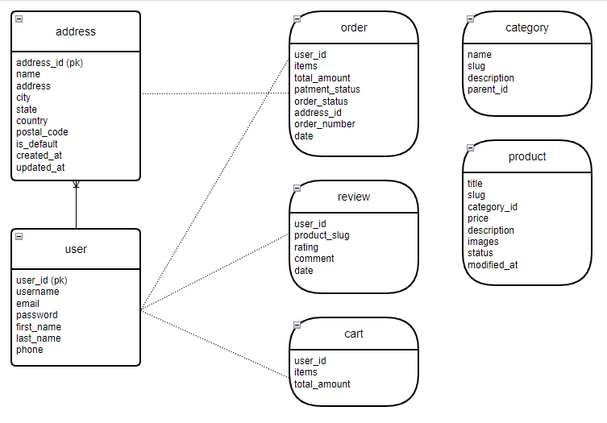

# 🍯 Honey Site – Hybrid Database E-commerce Application

This project is a **honey shop web application** built with a **hybrid database architecture**, combining **SQLite** for relational data and **MongoDB** for document-based data.  
It demonstrates not only database design but also the application of **software design patterns** to build a scalable and maintainable system.

---

## 📖 Project Summary

The **Honey Site** is a **hybrid online store** built with Django that combines the power of **relational** and **document-oriented** databases:  

- **SQLite (relational)** → Manages **core user data** and **addresses**, where strict relational integrity is required.  
- **MongoDB (document-oriented)** → Handles **product catalog, reviews, shopping carts, and orders**, where schema flexibility and nested data structures are advantageous.  

This hybrid architecture leverages the strengths of each database system and demonstrates how they can be integrated seamlessly in a real-world Django application.  

### 🔑 Key Features
- **User Management (SQLite):** registration, login/logout, profile management, and saved addresses.  
- **Product Catalog (MongoDB):** categories, products, images, and availability status.  
- **Shopping Cart & Checkout (MongoDB + SQLite):** cart operations, order creation, shipping address selection from SQLite.  
- **Reviews System (Hybrid):** users (from SQLite) can leave reviews and ratings on products (from MongoDB).  
- **Clean Data Separation:** relational data stays in SQLite, flexible nested data lives in MongoDB.  

---

---

## 🏗️ Architecture Diagram


The diagram shows how **SQLite** and **MongoDB** work together to provide a hybrid storage solution.

---

## 📊 Database Design

### Relational Database (SQLite)
- **User** → Custom Django user model with phone number validation.  
- **Address** → Each user can store multiple addresses, one of which is the default.  

### Document Database (MongoDB)
- **Category**  
- **Product**  
- **Review**  
- **Cart**  
- **Order**  

---

## 🛒 Project Overview
The **Honey Site** delivers a complete e-commerce experience:
- User authentication & profile management (SQLite).  
- Product catalog and reviews (MongoDB).  
- Shopping cart and checkout system (MongoDB + SQLite).  
- Hybrid integration where **orders reference relational addresses and users**, while **product details and reviews stay in MongoDB**.  

---

## 👤 User & Authentication
- User accounts stored in SQLite.  
- Features:
  - Registration & login with validation.  
  - Secure authentication (Django built-in system).  
  - Profile and multiple saved addresses.  
  - Default address handling automatically on save.  

---

## 🛍️ Shopping & Catalog
- Products and categories stored in MongoDB.  
- Each product includes:
  - Title, description, price, slug, status, images, and timestamps.  
- Categories can be hierarchical (with parent-child relationship).  

---

## 🛒 Cart Management
- Each user has a MongoDB-based shopping cart.  
- Features:
  - Add/remove products.  
  - Track quantities dynamically.  
  - Automatic calculation of total price (see `utils.cart_total_amount`).  

---

## ✅ Checkout & Orders
- Orders are stored in MongoDB, referencing relational **User** and **Address**.  
- Each order includes:
  - Ordered items with quantities.  
  - Total price.  
  - Shipping address (from SQLite).  
  - Order status, payment status, unique order number.  

---

## ⭐ Product Reviews
- After purchase, users can submit reviews stored in MongoDB.  
- Each review includes:
  - User reference (SQLite).  
  - Product reference (MongoDB).  
  - Rating, comment, and timestamp.  

---

## 🔗 Data Flow
1. **User signs up** → Data in SQLite.  
2. **User browses products** → Data from MongoDB.  
3. **User adds products to cart** → Stored in MongoDB.  
4. **User checks out** → Order created in MongoDB + address from SQLite.  
5. **User reviews products** → Review stored in MongoDB, linked to SQLite user.  

---

## 🧩 Design Patterns in Use

This project demonstrates the usage of multiple **Design Patterns**:

1. **Singleton Pattern**  
   - Implemented in `mongodb_connector.py`.  
   - Ensures only one MongoDB connection instance is created and reused.  

2. **Observer Pattern**  
   - Used in Django’s **signals** (e.g., automatic updates when a model is saved, such as default address handling in `Address.save()`).  

3. **Decorator Pattern**  
   - Django’s authentication system (`@login_required`) and request handling (`@csrf_exempt`, `@require_http_methods`) follow the Decorator pattern.  

4. **Command Pattern**  
   - Django’s `manage.py` encapsulates operations like migrations, running the server, etc., each as a separate Command.  

5. **Factory Method Pattern**  
   - Seen in serializers (e.g., `AddressSerializer`) and managers (e.g., `ProductManager.create_product`), which generate structured instances of objects.  

6. **Template Method Pattern**  
   - Present in Django’s generic views and `BaseMongoModel`, where the base workflow (CRUD) is defined and child classes extend specific behavior.  

---

## 📂 Project Structure

```
backend/
│── core/
│   ├── models.py          # User & Address models (SQLite)
│   ├── views.py           # Authentication & user management
│   ├── serializers.py     # DRF serializers
│
│── honey_api/
│   ├── mongo_models.py    # Managers for MongoDB collections
│   ├── utils.py           # Slug generation, cart calculation, helpers
│
│── mongodb_connector.py   # Singleton for MongoDB connection
│── manage.py              # Django management commands
```

---

## 🚀 How to Run the Project

### 1️⃣ Clone the repository
```bash
git clone https://github.com/mohammadsadeg24/Software-engineering.git
cd Software-engineering
```

### 2️⃣ Install dependencies
```bash
pip install -r requirements.txt
```

### 3️⃣ Setup the databases
* **MongoDB**: runs automatically via `mongodb_connector` (default: `mongodb://localhost:27017`).  
* **SQLite**: created automatically (`db.sqlite3`) after migrations.  

```bash
python manage.py migrate
```

### 4️⃣ Start the server
```bash
python backend/manage.py runserver
```

### 5️⃣ Access the app
```
http://127.0.0.1:8000/
```

---

## 🧪 Example Features in Action
- **Register a new user** → stored in SQLite.  
- **Add product to cart** → stored in MongoDB.  
- **Checkout** → generates MongoDB order + fetches SQLite address.  
- **Leave a review** → saved in MongoDB with user reference.  

---

## 🌟 Key Takeaways
- Demonstrates **hybrid database architecture** with SQLite + MongoDB.  
- Combines **relational integrity** with **document flexibility**.  
- Implements **common design patterns** to ensure maintainability.  
- Provides a **realistic e-commerce workflow** with users, products, carts, orders, and reviews.  

---
